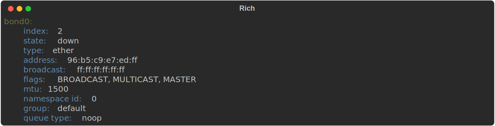

# netviewer

A command line utility to display network information.

Information is parsed from the output of the `iproute2` `ip` command with the json option.

```
netviewer [-d|--detail] <command> [<argument>...]
```

where `command` is one of

| Command    | Description                                       |
| ---------- | ------------------------------------------------- |
| bridge     | display information on all or specific bridges    |
| bridges    | list bridges                                      |
| dump       | dumps the network information as a json file      |
| interface  | display information on all or specific interfaces |
| interfaces | list interfaces                                   |
| link       | display information on all or specific links      |
| links      | list links                                        |
| route      | display information on all or specific bridges    |
| routes     | list routes                                       |

Using the `-d/--detail` flags with the `interface`, `bridge`, `route` and `link` commands displays detailed information.

Items which are `up` or in an `unknown` state are shown in green otherwise they are shown as dim green (the loopback interface is in an unknown state but can be used, so `unknown` states are also shown as green.)

## Commands

### bridge

Displays information about bridge devices i.e. network devices that have associated `veth` devices under them.

### dump

Dumps the the network information as a json file to the filename passed as an argument.

### interface

Displays interface information from the `ip address show` command. Pass interface names as arguments to display specific interfaces or leave blank to display all interfaces.

### route

Displays routing information from the `ip route show` command.

### link

Displays link information from the `ip link show` command.

## JSON input

Using the --input option the network information can be displayed from a static json file.

## SVG/HTML Output

Using the `--save-svg` and `--save-html` options the output can be sent to a file instead.

This utilises functionality built into [rich](https://rich.readthedocs.io/en/latest/)

### Example SVG Output



## Examples

### Interfaces

For example using the `interfaces` command

```
$ netviewer interfaces
```

in WSL on my machine displays the following information

```
lo
eth0
bond0
dummy0
sit0
tunl0
```

### Interface

And using the `interface` command for the `lo` interface

```
$ netviewer interface lo
```

displays the following information

```
lo:
    index: 1
    type: loopback
    state: unknown
    ipv4:
        scope: host
        ip: 127.0.0.1/8
        preferred lifetime: forever
        valid lifetime: forever
    ipv6:
        scope: host
        ip: ::1/128
        preferred lifetime: forever
        valid lifetime: forever
    flags: LOOPBACK, UP, LOWER_UP
    mtu:
        size: 65536
```

### Link

Running the `link` command

```
$ netviewer link bond0
```

Displays the following

```
bond0:
    index: 2
    state: down
    type: ether
    address: 96:b5:c9:e7:ed:ff
    broadcast: ff:ff:ff:ff:ff:ff
    flags: BROADCAST, MULTICAST, MASTER
    mtu: 1500
    namespace id: 0
    group: default
    queue type: noop
```

### Link - Detailed Info

Running the `link` command with the `-d/--detail` option

```
$ netviewer -d link bond0
```

Displays the following

```
bond0:
    index: 2
    state: down
    type: ether
    address: 96:b5:c9:e7:ed:ff
    broadcast: ff:ff:ff:ff:ff:ff
    flags: BROADCAST, MULTICAST, MASTER
    mtu: 1500
    namespace id: 0
    group: default
    queue type: noop
    link info:
        type: bond
        mode: balance-rr
        miimon: 0
        up delay: 0ms
        down delay: 0ms
        peer notifier delay: 0ms
        use carrier: true (1)
        ARP interval: 0ms
        ARP validate: active
        arp all targets: any
        primary reselect: always
        failover mac: none
        transmit hash policy: layer2
        resend IGMP: 1
        all slaves active: dropped
        minimum links: 0
        lp interval: 1s
        packets per slave: 1
        LACP rate: slow
        LACP aggregation selection logic: stable
        tb mode dynamic shuffling: 1
```
